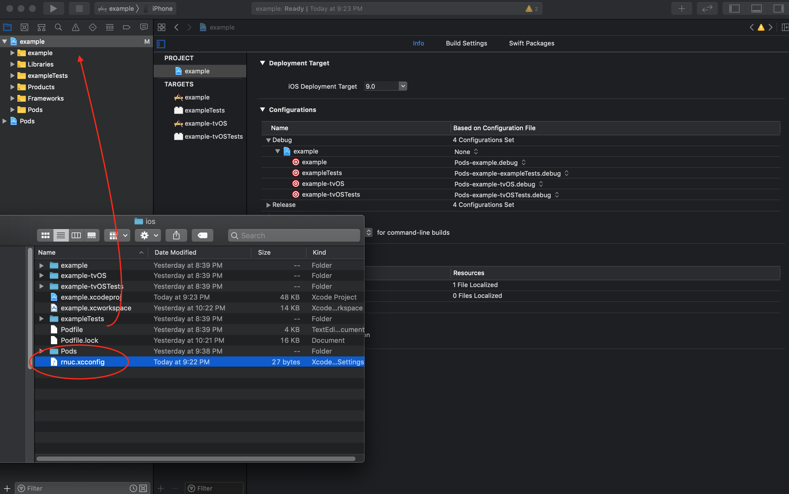
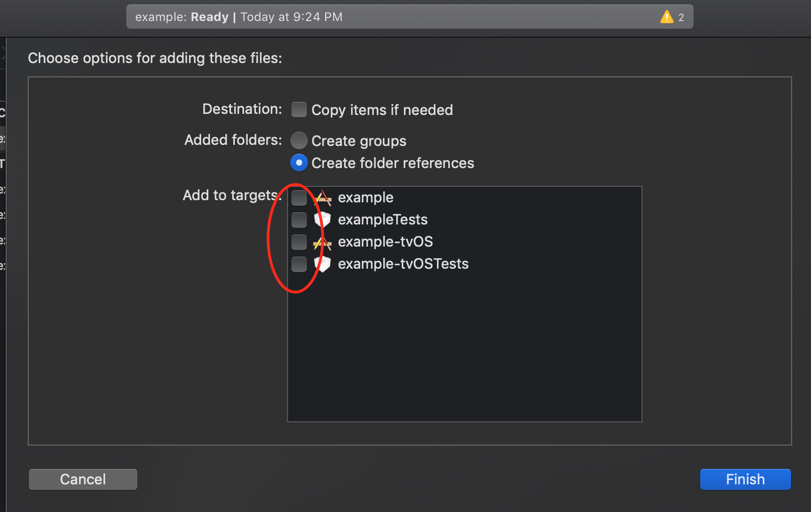

# react-native-ultimate-config

This library exposes configuration from env files to javascript, native code 
and native build configuration of ios and android projects.

## Quickstart

1. Add dependency

    `yarn add react-native-ultimate-config`

1. Create example file

    ```bash
    echo "MY_CONFIG=hello" > .env
    ```

1. Update .gitignore

    Add this to `.gitignore`:

    ```
    # react-native-ultimate-config
    rnuc.xcconfig
    rnuc.properties
    ```

1. Generate files

    Create script for executable in your `package.json`

    ```json
    "scripts": {
        "setenv": "./node_modules/react-native-ultimate-config/bin.js"
    }
    ```

    generate env files for navite projects

    ```bash
    yarn setenv .env
    ```

1. Configure navite projects

    1. ios

        1. open workspace
        1. open Finder in folder `ios`
        1. drag'n'drop generated file into project
            
            
        1. go to project settings
        1. set `rnuc.config` as root configuration for both "Debug" and "Release"
            

    1. android

        Add this right after applying react's plugin:

        ```gradle
        apply from: "../../node_modules/react-native-ultimate-config/android/rnuc.gradle"
        ```

        Final code: 

        ```gradle
        apply from: "../../node_modules/react-native/react.gradle"
        apply from: "../../node_modules/react-native-ultimate-config/android/rnuc.gradle"
        ````


## API

### Javascript

```javascript

// import module
import config from 'react-native-ultimate-config'

// access variables
config.MY_CONFIG
```

### ios


#### Info.plist

All values from env file are exposed to Build Settings and therefore 
automatically available in info plist.

Example: set app name from config

env file:
```env
APP_NAME=example
```

update info plist and observe app name changed:


#### Objective-c

```objc
#import <react-native-ultimate-config/ConfigValues.h>
...
NSLog(APP_NAME);
```

### Android

Gradle plugin of a library injects environment variables into as:

1. `BuildConfig` entries
1. stirng resources
1. `project.ext.env` of `build.gradle`

#### build.gradle

you can access config variales with simple 

```gradle
project.config.get("APP_NAME")
```

#### AndroidManifest.xml

All values from environment are made available as string resources.
They are accessible as:

```xml
      <activity
        ...
        android:label="@string/APP_NAME"
        />
        ...
      </activity>
```

#### Java

All variables are exposed via `BuilConfig`. They are accessible as:

```java
package com.example;

import android.os.Bundle;
import android.util.Log;
import com.facebook.react.ReactActivity;

public class MainActivity extends ReactActivity {

  /**
   * Returns the name of the main component registered from JavaScript. This is used to schedule
   * rendering of the component.
   */
  @Override
  protected String getMainComponentName() {
    return "example";
  }

  @Override
  public void onCreate(Bundle savedInstanceState) {
    super.onCreate(savedInstanceState);
    Log.d("onCreate", BuildConfig.APP_NAME);
  }

}

```
